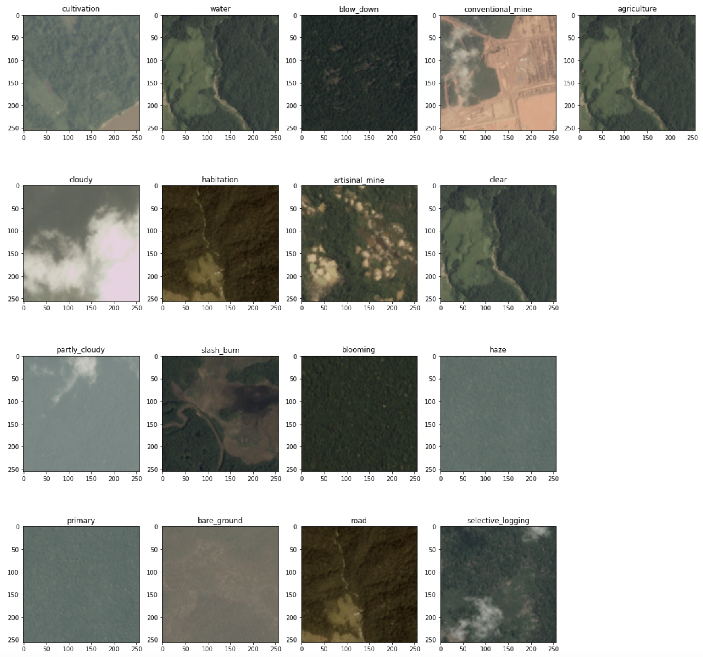

## Modelling

Multilabel classification with planet-understanding-the-amazon-from-space [task](https://www.kaggle.com/competitions/planet-understanding-the-amazon-from-space/overview).

### Dataset



Download the dataset from [here](https://www.kaggle.com/c/planet-understanding-the-amazon-from-space/data)

### Pipeline preparing

1. Create and activate environment
    ```
    python3 -m venv /path/to/new/virtual/environment
    ```
    ```
    source /path/to/new/virtual/environment/bin/activate
    ```

2. Install packages

    from activated environment:
    ```
    pip install -r requirements.txt
    ```

3.  Split dataset on train/val/test samples:
    ```
    python train_test_split.py -i path/to/dataframe -o path/to/save/splited/dataframes -drop-cols tags -col_id image_name
    ```
    or use this [link](https://www.kaggle.com/code/syeddanish/stratified-validation-split)

4. ClearML setting
    - [in your ClearML profile](https://app.community.clear.ml/profile) click "Create new credentials"
    - write down `clearml-init` and continue by instruction steps

### Training with Catalyst
Start with `nohup`:

```
CUDA_VISIBLE_DEVICES=0 OMP_NUM_THREADS=1 ROOT_PATH=/data/amazon nohup python train_cat.py configs/simple_config_cat.py > log.out
```

Start without `nohup`:

```
CUDA_VISIBLE_DEVICES=0 OMP_NUM_THREADS=1 ROOT_PATH=/data/amazon python train_cat.py configs/simple_config_cat.py
```

### Training with pytorch-lightning
Start with `nohup`:

```
CUDA_VISIBLE_DEVICES=0 OMP_NUM_THREADS=1 ROOT_PATH=/data/amazon nohup python train_pl.py configs/simple_config_pl.py > log.out
```

Start without `nohup`:

```
CUDA_VISIBLE_DEVICES=0 OMP_NUM_THREADS=1 ROOT_PATH=/data/amazon python train_pl.py configs/simple_config_pl.py
```

### Export to script

Convert model to script format with `notebooks/convert-to-script.ipynb`

### Download weights

```
dvc pull -R weights -r storage (for ssh)
dvc pull -R weights -r gstorage (for gdrive)
```

### Predict

```
python predict.py -w /path/to/your/weights -i /path/to/your/image --show
```

### Experiments logging

* Catalyst resnet18 https://app.clear.ml/projects/1355cffc7cea484db03f81ca07239a69/experiments/ea958aa81dda4c1b8cb3354ba8542c07/output/execution

* Catalyst efficientnet_b3 https://app.clear.ml/projects/1355cffc7cea484db03f81ca07239a69/experiments/069bb557d87d46fa8b64adc8151f1609/output/execution

* pytorch-lightning resnet18 (only test) https://app.clear.ml/projects/1355cffc7cea484db03f81ca07239a69/experiments/726e6d4cf9f6492fb1761e9cc486e0b1/output/execution

* pytorch-lightning efficientnet_b3 https://app.clear.ml/projects/1355cffc7cea484db03f81ca07239a69/experiments/4fa7010eb67149938612d18880073933/output/execution